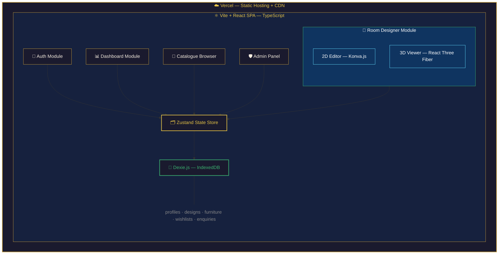

<p align="center">
  
</p>

<h1 align="center">RoomCraft Pro</h1>

<p align="center">
  <strong>Intelligent Furniture Visualization & Room Design Platform</strong>
</p>

<p align="center">
  <a href="https://room-craft-pro.vercel.app">
    
  </a>
  &nbsp;
  
  
  
  
  
</p>

<p align="center">
  <em>See your dream room before it becomes reality.</em>
</p>

---

## 📋 Table of Contents

- [Live Demo](#-live-demo)
- [Quick Start](#-quick-start)
- [Overview](#-overview)
- [Key Features](#-key-features)
- [Tech Stack](#-tech-stack)
- [Architecture](#-architecture)
- [Demo Accounts](#-demo-accounts)
- [Project Structure](#-project-structure)
- [Scripts](#-scripts)
- [Design System](#-design-system)
- [Computer Graphics Algorithms](#-computer-graphics-algorithms)
- [HCI Principles](#-hci-principles)
- [Sprint History](#-sprint-history)
- [Roadmap](#-roadmap)
- [License](#-license)

---

## 🌐 Live Demo: [room-craft-pro.vercel.app](https://room-craft-pro.vercel.app)

---

## ⚡ One-Click Setup

Clone the repo and run the setup script — it installs dependencies, verifies TypeScript, and starts the dev server in one command:

**Windows:**
```bash
git clone https://github.com/DilshanIBY/RoomCraft_Pro.git
cd RoomCraft_Pro
setup.bat
```

**macOS / Linux:**
```bash
git clone https://github.com/DilshanIBY/RoomCraft_Pro.git
cd RoomCraft_Pro
chmod +x setup.sh
./setup.sh
```

### Manual Setup

```bash
# 1. Clone the repository
git clone https://github.com/DilshanIBY/RoomCraft_Pro.git
cd RoomCraft_Pro

# 2. Install dependencies
npm install

# 3. Start the development server
npm run dev
```

The app will be available at **http://localhost:5173**

### Production Build

```bash
# Build optimized production bundle
npm run build

# Preview the production build locally
npm run preview
```

---

## 🏠 Overview

**RoomCraft Pro** is a premium, web-based furniture visualization platform built for an upscale furniture company. It empowers **in-store designers** to collaborate with walk-in customers in real time and allows **remote customers** to independently explore, customize, and visualize furniture placements — transitioning seamlessly between a **2D floor-plan editor** and **immersive 3D room walkthroughs**.

The entire application is a **client-side SPA** — all data is stored in the browser's IndexedDB via **Dexie.js**. There is **no external server, no API calls, and no backend that can go offline**. The app ships with pre-seeded demo data so it's immediately usable upon first visit.

### Why RoomCraft Pro?

| Problem | Solution |
|---|---|
| Customers can't visualize furniture in their rooms | Interactive 2D + 3D room designer with real furniture models |
| Purchase hesitation and costly returns | See exactly how pieces fit, look, and complement a space |
| Designers rely on slow sketches and mood boards | Real-time visualization closes sales faster |
| Backend databases can go offline for demos | Zero-backend architecture — IndexedDB never pauses or expires |

---

## ✨ Key Features

### 🎯 Core

| Feature | Description |
|---|---|
| **Dual-View Engine** | Seamless 2D ↔ 3D toggle with fully synchronized state |
| **2D Floor Plan Editor** | Konva.js canvas — drag, drop, rotate, scale furniture with snap-to-grid and measurement guides |
| **3D Room Visualization** | React Three Fiber — orbit controls, realistic PBR lighting, shadow mapping, environment maps |
| **Multi-Role Architecture** | Distinct experiences for **Designers**, **Customers**, and **Admins** |
| **Room Configuration Wizard** | 4-step guided setup — shape, dimensions, walls, floors — with live preview |

### 🎨 Design & Customization

| Feature | Description |
|---|---|
| **Advanced Color System** | Change individual/batch furniture colors, wall colors, HSL shade/tint adjustments |
| **Curated Palettes** | Modern, Scandinavian, Industrial, Warm Neutral, Bold — brand-aligned presets |
| **Architectural Features** | Doors and windows with complex 2D swing arcs and detailed 3D mesh rendering |
| **7+ Room Templates** | L-Shaped Suite, Open Plan Loft, and more — instant auto-fill via wizard |

### 🛒 Customer Experience

| Feature | Description |
|---|---|
| **Style Quiz** | 5-question animated quiz with personalized result profiles |
| **Wishlist** | Save furniture items with real-time UI toggles and toast feedback |
| **Enquiry / Quote Request** | 3-step checkout-style workflow (Summary → Contact → Confirmation) |
| **Inspiration Gallery** | Browse 6 pre-configured templates with one-click "Use This Template" |
| **Design Sharing** | Export designs as `.roomcraft.json` or high-res PNG screenshots |

### 🛡️ Admin Dashboard

| Feature | Description |
|---|---|
| **Analytics Hub** | CSS-only donut/bar charts for role distribution and furniture popularity |
| **Designer Management** | Live KPIs, search filtering, account activation/deactivation |
| **Content Management** | Catalogue, templates, designs, and enquiry management pages |
| **10-Section Modular Sidebar** | Dedicated sub-pages for People, Content, and Account management |

---

## 🛠️ Tech Stack

| Layer | Technology | Purpose |
|---|---|---|
| **Frontend** | React 19 + TypeScript 5.9 | UI components with strict typing |
| **Build Tool** | Vite 8 | Sub-second HMR, optimized production builds |
| **3D Engine** | Three.js + React Three Fiber + Drei | Declarative 3D rendering, orbit controls, environment maps |
| **2D Canvas** | Konva.js + react-konva | High-performance floor plan editing |
| **State Management** | Zustand | Lightweight cross-component state sync |
| **Database** | Dexie.js (IndexedDB) | Client-side persistence — no backend required |
| **Styling** | Vanilla CSS + CSS Modules | Full control over glassmorphism, custom properties |
| **Routing** | React Router v7 | Client-side multi-page SPA navigation |
| **Animation** | Framer Motion | Production-grade layout transitions and gestures |
| **Icons** | Lucide React | Consistent, tree-shakeable icon set |
| **Hosting** | Vercel | Global CDN, instant deploys, free tier |

---

## 🏗️ Architecture



---

## 🔐 Demo Accounts

The app ships with **pre-seeded demo data** — three accounts are ready to use immediately:

| Role | Email | Password |
|---|---|---|
| 🛡️ **Admin** | `admin@roomcraft.com` | `Demo@123` |
| 🎨 **Designer** | `designer@roomcraft.com` | `Demo@123` |
| 🛋️ **Customer** | `customer@roomcraft.com` | `Demo@123` |

> **Tip:** One-click login shortcuts are available on the login page for quick access.

---

## 📁 Project Structure

```
RoomCraft_Pro/
├── public/
│   ├── favicon.svg             # App icon (gold furniture logo)
│   ├── icons.svg               # SVG sprite sheet
│   └── thumbnails/             # Furniture thumbnail images
│
├── src/
│   ├── main.tsx                # App entry point
│   ├── App.tsx                 # Root component — routing, auth guards, theme
│   ├── App.css                 # Global styles (~124KB — full design system)
│   ├── index.css               # CSS reset & variables (~28KB)
│   │
│   ├── components/
│   │   ├── FloorPlanCanvas.tsx # 2D Konva.js floor plan editor (~26KB)
│   │   └── RoomScene3D.tsx     # 3D React Three Fiber renderer (~26KB)
│   │
│   ├── pages/
│   │   ├── SplashPage.tsx      # Premium animated landing page
│   │   ├── LoginPage.tsx       # Glass-card login with demo shortcuts
│   │   ├── RegisterPage.tsx    # Multi-step registration flow
│   │   ├── ForgotPasswordPage.tsx
│   │   ├── DashboardPage.tsx   # Role-adaptive dashboard (Designer/Customer/Admin)
│   │   ├── DesignerWorkspace.tsx # Core 3-column design workspace
│   │   ├── CataloguePage.tsx   # Furniture browser with filters
│   │   ├── MyDesignsPage.tsx   # Saved designs management
│   │   ├── RoomWizard.tsx      # 4-step guided room setup
│   │   ├── StyleQuizPage.tsx   # Animated style preference quiz
│   │   ├── WishlistPage.tsx    # Customer wishlist
│   │   ├── EnquiryPage.tsx     # Quote request workflow
│   │   ├── InspirationPage.tsx # Room inspiration gallery
│   │   ├── SettingsPage.tsx    # Profile & theme settings
│   │   ├── Admin*.tsx          # 7 admin sub-pages (Analytics, Designers, etc.)
│   │   └── ...
│   │
│   ├── store/
│   │   ├── useAppStore.ts      # Zustand — room design, furniture, undo/redo
│   │   └── useAuthStore.ts     # Zustand — authentication & session
│   │
│   ├── db/
│   │   ├── db.ts               # Dexie.js schema definition
│   │   └── seed.ts             # Demo data seeder (profiles, furniture, designs)
│   │
│   └── assets/                 # Static assets (images, etc.)
│
├── docs/                       # Project documentation (gitignored)
│   ├── PRD.md                  # Product Requirements Document
│   ├── Requirement_Tracker.md  # Development progress tracker
│   └── Sprint_commits.md       # Sprint history & changelog
│
├── setup.bat                   # One-click setup (Windows)
├── setup.sh                    # One-click setup (macOS/Linux)
├── index.html                  # HTML entry point
├── package.json                # Dependencies & scripts
├── vite.config.ts              # Vite configuration
├── tsconfig.json               # TypeScript configuration
└── eslint.config.js            # ESLint rules
```

---

## 📜 Scripts

| Command | Description |
|---|---|
| `npm run dev` | Start Vite dev server with HMR at `localhost:5173` |
| `npm run build` | TypeScript compile + Vite production build → `dist/` |
| `npm run preview` | Preview the production build locally |
| `npm run lint` | Run ESLint across the entire project |

---

## 🎨 Design System

### "Exclusive Gold Glass" — Design Language

The UI follows a bespoke **"Exclusive Gold Glass"** design language — a fusion of **Glassmorphism 2.0**, luxury **wood-inspired warmth**, and **depth-based spatial hierarchy**. The palette draws from the furniture craft itself:

| Element | Light Theme | Dark Theme |
|---|---|---|
| **Background** | `#FAF7F2` — Warm ivory | `#0F0A06` — Deep mahogany |
| **Primary Accent** | `#C49A3C` — Brushed gold | `#E8C547` — Bright gold |
| **Secondary Accent** | `#2D6B4F` — Deep emerald | `#3CB371` — Light emerald |
| **Text** | `#2C1810` — Walnut brown | `#F5EDE0` — Soft cream |
| **Glass Surfaces** | `rgba(255,250,240,0.72)` | `rgba(255,220,160,0.05)` |

### Typography

| Role | Font | Weight |
|---|---|---|
| Display / Hero | **Playfair Display** | 700 |
| Headings | **DM Sans** | 600 |
| Body | **Inter** | 400 / 500 |
| Dimensions | **JetBrains Mono** | 400 |

---

## 🧮 Computer Graphics Algorithms

| Category | Algorithm | Implementation |
|---|---|---|
| **Coordinate Transforms** | World ↔ Screen, 2D ↔ 3D mapping | Real-world meters → canvas pixels; inverse transforms for click-to-place |
| **Geometric Transforms** | Translation, Rotation, Scaling | Konva node transforms + Three.js `Object3D.position/rotation/scale` |
| **Rendering** | PBR Shading, Shadow Mapping | `MeshStandardMaterial` with metalness/roughness; `DirectionalLight.castShadow` |
| **Interaction** | Ray Casting, Hit Detection | Three.js `Raycaster` for 3D; Konva bounding-box for 2D |
| **Spatial** | AABB Collision, Snap-to-Grid | Axis-aligned overlap prevention; coordinate quantization during drag |
| **Camera** | Perspective Projection | Configurable FOV, near/far planes; orbit controls |
| **Environment** | HDRI Mapping | Environment maps for realistic reflections on glossy surfaces |

---

## 🧠 HCI Principles

The application is designed with rigorous attention to Human-Computer Interaction research:

- **Nielsen's 10 Heuristics** — Visibility of system status, user control (undo/redo), consistency, error prevention, recognition over recall
- **Fitts's Law** — Large targets for frequent actions; edge-placed tools; minimal cursor travel
- **Gestalt Principles** — Proximity grouping in panels; similarity across cards; figure-ground depth hierarchy
- **Cognitive Load Theory** — 4-step wizard chunking; progressive disclosure; familiar metaphors
- **WCAG 2.1 AA** — 4.5:1 contrast ratios; keyboard navigation; ARIA labels; `prefers-reduced-motion`

---

## 📈 Sprint History

| Sprint | Period | Highlights |
|---|---|---|
| **Sprint 1** | Jan 19 – 25 | Core infrastructure, auth, 2D canvas baseline, Exclusive Gold Glass design system |
| **Sprint 2** | Jan 26 – Feb 1 | Drag-and-drop catalogue, transformation controls, snap-to-grid, measurement lines |
| **Sprint 3** | Feb 2 – 8 | 3D engine (R3F), synchronized 2D/3D state, color system, auto-save |
| **Sprint 4** | Feb 9 – 15 | Catalogue browser, 7 room templates, Style Quiz, design management |
| **Sprint 5** | Feb 16 – 22 | Wishlist, Enquiry workflow, Inspiration Gallery, customer features |
| **Sprint 6** | Feb 23 – Mar 1 | Doors/windows, 3D export, design sharing, WCAG compliance |
| **Sprint 7** | Mar 2 – 8 | Admin Dashboard overhaul — 10-section hub, analytics, designer management |
| **Sprint 8** | Mar 9 – 15 | Premium landing page, scroll-driven 3D hero, 404 page, production polish |

---

## 🗺️ Roadmap

| Feature | Status |
|---|---|
| AR Preview via WebXR | 🔮 Planned |
| AI-Powered Layout Suggestions | 🔮 Planned |
| Collaborative Design Sessions (WebRTC) | 🔮 Planned |
| PDF Export with Bill of Materials | 🔮 Planned |
| Cloud Sync (optional Supabase/Firebase) | 🔮 Planned |
| Multi-select & Group Furniture | ⏳ Backlog |
| First-Person Walkthrough (WASD) | ⏳ Backlog |
| 360° Furniture Preview | ⏳ Backlog |

---

## 📄 License

This project was built as part of the **HCI (Human-Computer Interaction)** coursework at **Plymouth University**.

---

<p align="center">
  <strong>Built with ❤️ and ☕ by Plymouth University Students</strong><br/>
  <sub>React • Three.js • Konva • Zustand • Dexie • Vite • Vercel</sub>
</p>
